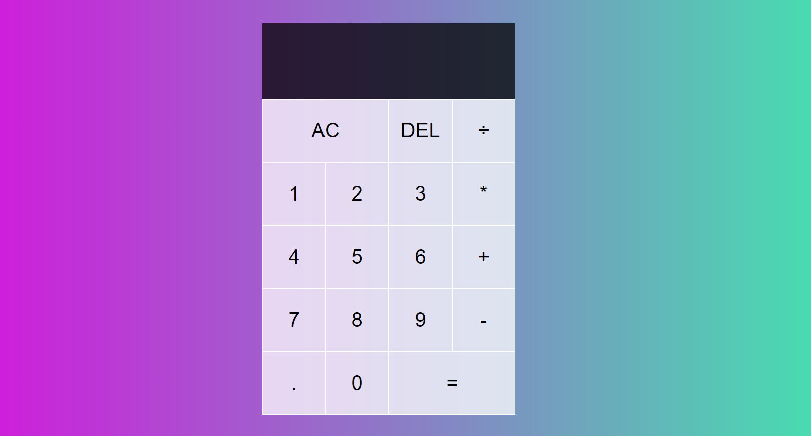

# basic-calculator
A basic calculator made with Html, CSS, JavaScript. 

How to use this.

1) Copy the repository in your code editor
2) Add/Remove features as your like
3) Locally run the project through a modern brower  
